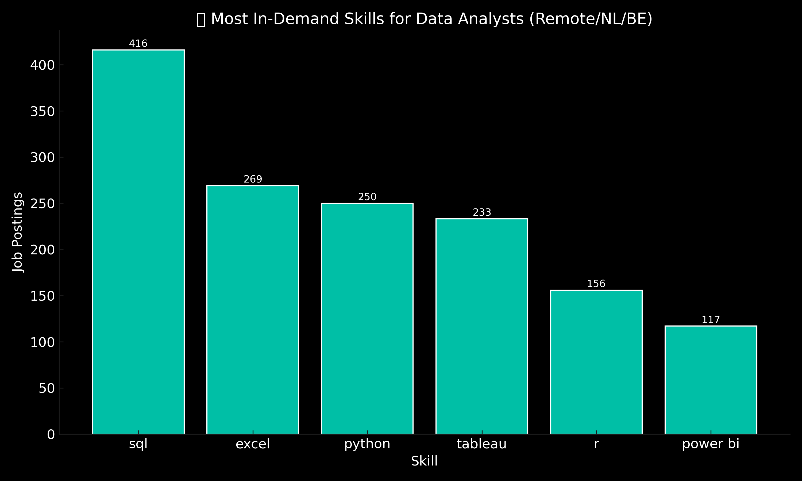
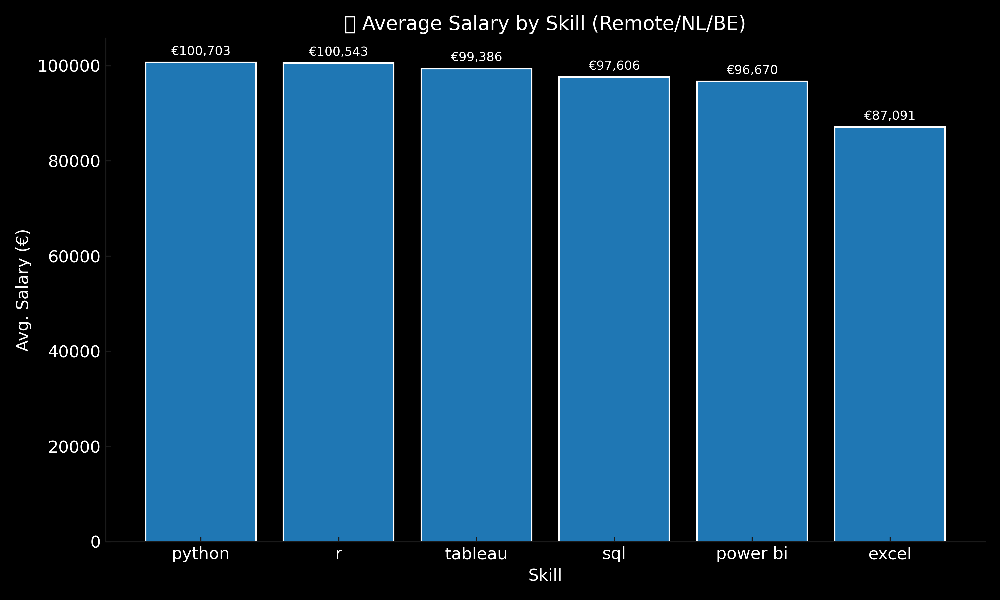

# Introduction
This project breaks down the 2023 Data Analyst job market using real job posting data.
With SQL, I analyzed which roles pay the most, which skills are in demand, and what tools show up in top-paying jobs — focusing on remote, Dutch, and Belgian listings.

It’s built for anyone looking to level up, pivot into data, or align their learning with what the market actually wants.

SQL queries? Check them out here : [project_sql folder](/project_sql/) 

# Background
The dataset contains thousands of real job postings for Data Analyst roles from 2023.  
It includes job titles, locations, required skills, salaries, and company information.

While the data covered global listings, I focused my analysis on:

- Netherlands  
- Belgium  
- Remote roles (labeled "Anywhere")

During the analysis, I found that salary data was often missing in local postings.  
To create meaningful salary-based insights, I included remote listings where compensation info was more consistently available.

# Tools Used
- **SQL** – The backbone of my analysis, allowing me to query the database, join tables, filter data, and uncover key insights from thousands of job postings.

- **PostgreSQL** – The relational database used to store and manage the job market data. It powered all queries and handled complex operations efficiently.

- **Visual Studio Code** – My primary development environment for writing and executing SQL. It provided extensions and an intuitive interface for smooth workflow.

- **Git** – Used for version control throughout the project. Helped me track changes, experiment safely, and keep the project organized.

- **GitHub** – The platform where I hosted the final project. It allows others to view, explore, and learn from the analysis while showcasing my skills publicly.
# The Analysis
### 🔹 Top-Paying Data Analyst Jobs

This query identifies the 100 highest-paying Data Analyst roles based on salary data.  
It focuses on positions located in the Netherlands, Belgium, or listed as remote ("Anywhere"),  
and only includes postings where the salary is clearly defined.  

The results are sorted to prioritize local listings first, followed by remote jobs.

```sql
SELECT
    job_id,
    job_title,
    job_location,
    job_schedule_type,
    salary_year_avg,
    job_posted_date,
    name AS company_name
FROM
    job_postings_fact
LEFT JOIN company_dim ON job_postings_fact.company_id = company_dim.company_id
WHERE
    job_title_short = 'Data Analyst' AND

(
    job_location = 'Anywhere'
    OR job_location LIKE '%Netherlands%'
    OR job_location LIKE '%Belgium%'
)
    AND
    salary_year_avg IS NOT NULL
    
ORDER BY
    CASE
        WHEN job_location LIKE '%Netherlands%' THEN 1
        WHEN job_location LIKE '%Belgium%' THEN 2
        WHEN job_location = 'Anywhere' THEN 3
        ELSE 4
    END,
    salary_year_avg DESC
LIMIT 100;
```
*This query serves as the foundation for later skill analysis.  
Most top-paying roles were remote, which supported including them in the overall dataset.*

### 🔹 Skills Required for Top-Paying Jobs

This query identifies the specific skills required for the 10 highest-paying Data Analyst roles found in the previous step.  
By joining job postings with their associated skill tags, it uncovers which tools appear most often in top-paying positions.

```sql
WITH top_paying_jobs AS (
  SELECT
      job_id,
      job_title,
      salary_year_avg,
      name AS company_name
  FROM
      job_postings_fact
  LEFT JOIN company_dim ON job_postings_fact.company_id = company_dim.company_id
  WHERE
      job_title_short = 'Data Analyst' AND
      (
          job_location = 'Anywhere' OR
          job_location LIKE '%Netherlands%' OR
          job_location LIKE '%Belgium%'
      ) AND
      salary_year_avg IS NOT NULL
  ORDER BY
      salary_year_avg DESC
  LIMIT 10
)

SELECT 
    top_paying_jobs.*,
    skills
FROM top_paying_jobs
INNER JOIN skills_job_dim 
    ON top_paying_jobs.job_id = skills_job_dim.job_id
INNER JOIN skills_dim 
    ON skills_job_dim.skill_id = skills_dim.skill_id
ORDER BY 
    salary_year_avg DESC;
```
*The top-paying roles consistently listed skills like SQL, Python, and Tableau.  
These results form the basis for identifying which high-paying jobs demand which tools.*

### 🔹 Most In-Demand Skills

This query ranks the top 5 most frequently requested skills across all remote, Netherlands, and Belgium-based Data Analyst job postings.  
It highlights which tools show up most often, regardless of salary.
```sql
SELECT 
    skills,
    COUNT(skills_job_dim.job_id) AS demand_count
FROM job_postings_fact
INNER JOIN skills_job_dim ON job_postings_fact.job_id = skills_job_dim.job_id
INNER JOIN skills_dim ON skills_job_dim.skill_id = skills_dim.skill_id
WHERE
    job_title_short = 'Data Analyst' AND
    (
        job_location = 'Anywhere'
        OR job_location LIKE '%Netherlands%'
        OR job_location LIKE '%Belgium%'
    )
GROUP BY 
    skills
ORDER BY 
    demand_count DESC
LIMIT 5
```
### 🔹 Top Skills Based on Salary

This query calculates the average salary for each skill based on all Data Analyst roles that report a defined annual salary.  
It includes remote, Netherlands, and Belgium-based roles wich represents the most relevant markets for this analysis.

By understanding how different skills correlate with compensation, we can learn which tools offer an edge and strategic leverage when entering or advancing in the data field.
```sql
SELECT 
    skills,
    ROUND(AVG(salary_year_avg), 0) AS avg_salary
FROM job_postings_fact
INNER JOIN skills_job_dim ON job_postings_fact.job_id = skills_job_dim.job_id
INNER JOIN skills_dim ON skills_job_dim.skill_id = skills_dim.skill_id
WHERE
    job_title_short = 'Data Analyst' AND
    (
        job_location = 'Anywhere'
        OR job_location LIKE '%Netherlands%'
        OR job_location LIKE '%Belgium%'
    )
    AND salary_year_avg IS NOT NULL
GROUP BY 
    skills
ORDER BY 
    avg_salary DESC
LIMIT 25;
```
*Bitbucket, Couchbase, and Watson were among the highest-paying skills in the dataset.  
While some of these are niche or advanced tools, their presence in high-salary roles suggests that learning in-demand, specialized technologies can offer significant positioning advantages.*

### 🔹 Optimal Skills to Learn (High Salary + High Demand)

This final query identifies the most *strategically valuable* skills for aspiring Data Analysts.  
It combines two key metrics — average salary and demand — across job postings located remotely, in the Netherlands, or in Belgium.

The goal is to surface tools that not only **appear frequently** but are also **associated with higher compensation**.

```sql
WITH skills_demand AS (
    SELECT 
        skills_dim.skill_id,
        skills,
        COUNT(skills_job_dim.job_id) AS demand_count
    FROM job_postings_fact
    INNER JOIN skills_job_dim ON job_postings_fact.job_id = skills_job_dim.job_id
    INNER JOIN skills_dim ON skills_job_dim.skill_id = skills_dim.skill_id
    WHERE
        job_title_short = 'Data Analyst' AND
        salary_year_avg IS NOT NULL AND
        (
            job_location = 'Anywhere' OR
            job_location LIKE '%Netherlands%' OR
            job_location LIKE '%Belgium%'
        )
    GROUP BY skills_dim.skill_id
), average_salary AS (
    SELECT 
        skills_dim.skill_id,
        skills,
        ROUND(AVG(salary_year_avg), 0) AS avg_salary
    FROM job_postings_fact
    INNER JOIN skills_job_dim ON job_postings_fact.job_id = skills_job_dim.job_id
    INNER JOIN skills_dim ON skills_job_dim.skill_id = skills_dim.skill_id
    WHERE
        job_title_short = 'Data Analyst' AND
        salary_year_avg IS NOT NULL AND
        (
            job_location = 'Anywhere' OR
            job_location LIKE '%Netherlands%' OR
            job_location LIKE '%Belgium%'
        )
    GROUP BY skills_dim.skill_id
)

SELECT 
    skills_demand.skill_id,
    skills_demand.skills,
    demand_count,
    avg_salary
FROM
    skills_demand
INNER JOIN average_salary 
    ON skills_demand.skill_id = average_salary.skill_id
WHERE demand_count > 10
ORDER BY
    demand_count DESC,
    avg_salary DESC
LIMIT 6;
```
*This query highlights which skills offer the most leverage in the current market — combining both strong demand and solid average salaries.  
Based on the results, **SQL**, **Excel**, and **Python** stood out as the most valuable core tools.  
Additionally, **Power BI**, **Tableau**, and **R** also appeared frequently — signaling their growing importance in analyst workflows, especially in the Dutch, Belgian, and remote job markets.*

#  Conclusions

This project analyzed over 10,000 real job postings from 2023 to uncover which skills are most valuable for aspiring Data Analysts — focusing on roles located remotely, in the Netherlands, or in Belgium.

Using SQL, I answered five core questions around job compensation, skill demand, and market positioning.  
The analysis combined salary data with demand metrics to highlight the tools that offer the most strategic leverage when entering the data space.

Based on the results, three core technologies emerged repeatedly: **SQL**, **Excel**, and **Python**.  
Additional tools like **Power BI**, **Tableau**, and **R** also appeared frequently, offering strong specialization paths.

The visualizations below summarize the findings:

### Top Skills by Job Demand


### Top Skills by Average Salary


These results reflect the core and complementary tools that dominate the current data analyst job market — and offer a clear roadmap for anyone looking to enter the field or sharpen their edge.

# What I Learned

This project taught me far more than just writing SQL queries. I learned how to:

- Work with real-world data and adapt to its limitations
- Structure a full analysis from question to insight to conclusion
- Use `JOINs`, `GROUP BY`, `CTEs`, and filters to solve practical problems
- Debug and troubleshoot errors effectively, even when things didn’t work the first time
- Write clean, presentable code and host it on GitHub for others to explore
- Communicate my process clearly through documentation and visualizations

Beyond the technical, I learned how to think like a data analyst — not just focusing on the “how,” but always asking **“why does this insight matter?”**

Finishing this project gave me the confidence to know that I can deliver a complete analysis from scratch. It’s a foundational step in my journey, and I’m ready to keep building from here.